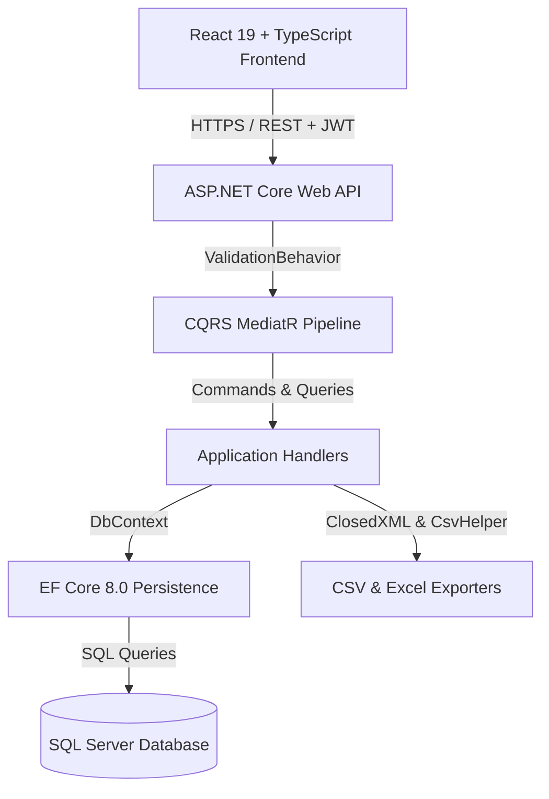

# 📊 InsightHub - Modern Multi-Tenant Data Analytics Platform

InsightHub is a state-of-the-art, high-performance data analytics and visualization platform built with **.NET 8 (ASP.NET Core Web API)** and **React 19 + Vite (TypeScript)**. It empowers data analysts to upload CSV and Excel datasets, compute rich statistical indicators, detect outliers using IQR algorithms, visualize correlations via 2D heatmaps, and export filtered results.

---

## 🌟 Key Features

### 🔐 Authentication & Multi-Tenant Data Isolation
- **JWT Bearer Authentication**: Secure user registration and login with signed JWT tokens containing role claims.
- **PBKDF2 Password Hashing**: Cryptographically salted password hashing using 100,000 PBKDF2 SHA-256 iterations.
- **User Dataset Isolation**: Analysts only view and manage datasets they own. Admin roles possess global visibility.

### 📈 Visual Analytics & Interactive Dashboards
- **Bar Chart (Average Values)**: Recharts visualization of numeric column means.
- **Pie Chart (Categorical Distributions)**: Interactive frequency distribution for text variables (e.g. `species`).
- **Line Chart (Row Trends)**: Row-based value trends across dataset records.
- **Scatter Plot (Correlation Matrix)**: Dual numeric column correlation scatter plot.
- **2D Correlation Heatmap**: Interactive correlation matrix with dynamic color scaling (purple for positive, red for negative).

### 🔢 Advanced Descriptive Statistics & Outliers
- **12-Metric Statistical Grid**: Mean, Median, Mode, Min, Max, Range, Q1 (25%), Q3 (75%), IQR, Variance, StdDev, Count.
- **Frequency Histogram**: Equal-width bin distribution visualization across numeric variables.
- **IQR Outlier Detection**: Automatic upper/lower bound calculation and detailed outlier row listing with status tags ("Alt Aykırı" / "Üst Aykırı").

### 📁 Dataset Management & Multi-Format Export
- **File Upload**: Supports `.csv`, `.xlsx`, and `.xls` files up to 50MB with background column analysis.
- **Raw Data Inspector**: Live paginated grid viewer for inspecting raw dataset rows.
- **CSV & Excel Export**: Instant export of datasets to `.csv` or `.xlsx` files using `ClosedXML` and `CsvHelper`.

---

## 🏗️ Architecture & Technology Stack

### 📐 Clean Architecture & System Flow



### Backend (`Backend/`)
- **Framework**: .NET 8.0 (C#)
- **Architecture**: Clean Architecture (Domain, Application, Infrastructure, API, Tests)
- **Pattern**: CQRS with MediatR & OpenBehaviors
- **Persistence**: Entity Framework Core 8.0 + SQL Server
- **Validation**: FluentValidation with global pipeline behaviors
- **Unit Testing**: xUnit + Moq (`InsightHub.Tests`)

### Frontend (`Frontend/InsightHub.Web/`)
- **Framework**: React 19 + TypeScript (Vite 8)
- **Styling**: Modern Vanilla CSS with Glassmorphism aesthetic, pastel accents, and fluid layouts
- **Charts**: Recharts 3.x
- **Proxy**: Vite HTTP proxy mapping `/api` requests to ASP.NET Core API server

---

## 🚀 Quick Start Guide

### Prerequisites
- [.NET 8.0 SDK](https://dotnet.microsoft.com/download/dotnet/8.0)
- [Node.js (v18+)](https://nodejs.org/) & `npm`
- SQL Server LocalDB or SQLEXPRESS (`Server=NAZLIBULDAG\SQLEXPRESS`)

### 1. Database Setup
Ensure SQL Server is running, then apply migrations:
```bash
dotnet ef database update --project Backend/InsightHub.Infrastructure --startup-project Backend/InsightHub.API
```

### 2. Run Backend API
```bash
dotnet run --project Backend/InsightHub.API
```
The API server will start on `http://localhost:5099` (HTTPS: `https://localhost:7028`). Swagger UI is available at `http://localhost:5099/swagger`.

### 3. Run Frontend Web App
```bash
cd Frontend/InsightHub.Web
npm install
npm run dev
```
Open `http://localhost:5174` in your browser.

---

## 🧪 Running Unit Tests

Run the full xUnit test suite:
```bash
dotnet test InsightHub.sln
```

---

## 📡 API Endpoints Overview

| Method | Endpoint | Description | Auth Required |
|---|---|---|---|
| `POST` | `/api/Auth/register` | Register a new user | ❌ |
| `POST` | `/api/Auth/login` | Login and receive JWT token | ❌ |
| `GET` | `/api/Auth/me` | Fetch active user profile | ✅ |
| `GET` | `/api/Datasets` | Get user's uploaded datasets | ✅ |
| `POST` | `/api/Datasets/upload` | Upload CSV / Excel file | ✅ |
| `GET` | `/api/Datasets/{id}` | Get dataset details & columns | ✅ |
| `GET` | `/api/Datasets/{id}/query` | Query rows with search, filter, sort & pagination | ✅ |
| `GET` | `/api/Datasets/{id}/export` | Export dataset as CSV (`format=csv`) or Excel (`format=excel`) | ✅ |
| `DELETE` | `/api/Datasets/{id}` | Delete dataset and row records | ✅ |
| `GET` | `/api/Dashboard/{id}` | Summary KPIs and health metrics | ✅ |
| `GET` | `/api/Analysis/{id}/correlation-matrix` | 2D correlation matrix | ✅ |
| `GET` | `/api/Analysis/{id}/statistics` | 12-card descriptive statistics | ✅ |
| `GET` | `/api/Analysis/{id}/outliers` | IQR bounds and outlier rows list | ✅ |
| `GET` | `/api/Analysis/{id}/distribution` | Frequency distribution histogram | ✅ |

---

## 📄 License
InsightHub is licensed under the MIT License.
